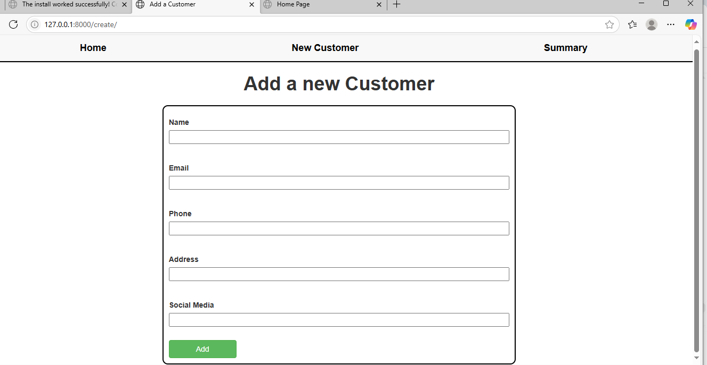
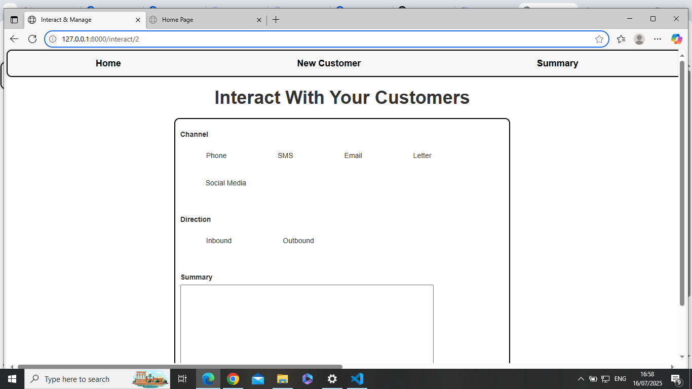
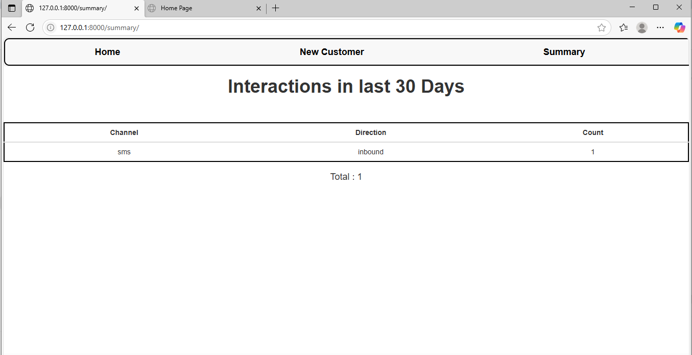

# Customer360 - Django App

Customer360 is a simple customer management system built with Django.  
It allows you to create customers, record interactions, and view communication summaries — all in a clean, local web interface.

---

## 🚀 Features

- Add new customers with contact info and social media handle
- Record customer interactions (inbound/outbound) across multiple channels
- View a summary of communications in the last 30 days
- Clean, Bootstrap-styled user interface

---

## 📷 Screenshots

### 🏠 Home Page

Displays all registered customers  


### ➕ Add Customer

Form to create a new customer  


### 💬 Interact with Customer

Select communication channel and direction  


### 📊 Summary View

Shows interaction analytics in last 30 days  


---

## 🛠️ Tech Stack

- Django 4+
- Python 3.11+
- Bootstrap (via CDN)
- SQLite (default Django DB)

---

## 📋 Getting Started

### 1. Clone the repo

```bash
git clone https://github.com/ibrahimnuhu0/customer360.git
cd customer360
```

### 2. Install dependencies

pip install -r requirements.txt

### 3. Apply migrations and start the server

```bash
python manage.py makemigrations
python manage.py migrate
python manage.py runserver
```

### 4. Open your browser

Go to:
http://127.0.0.1:8000/
